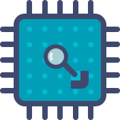
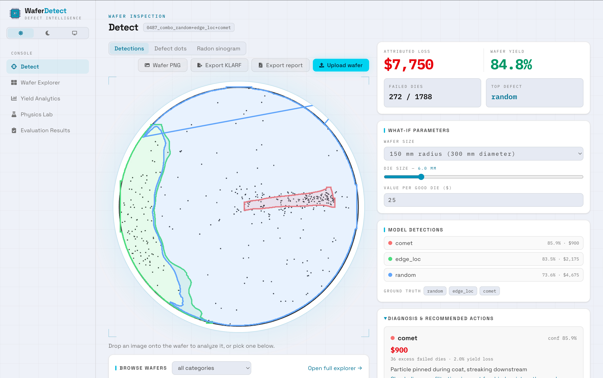

<p align="center">
  
</p>

<h1 align="center">WaferDetect</h1>

<p align="center">
  <strong>Wafer-map defect intelligence for semiconductor fabs</strong><br />
  Detect and segment failure patterns, diagnose their root causes, and quantify
  the yield loss in dollars — from a model trained entirely on synthetic data.
</p>

<p align="center">
  
</p>

---

## Why wafer maps

After fabrication, every die on a silicon wafer is electrically tested. Plotting the failing
dies by position produces a _wafer map_, and the spatial pattern of failures is a fingerprint
of a specific process problem: a scratch means mechanical handling damage, slip lines mean
thermal stress during rapid thermal processing, a repeating shot grid points at the
lithography stepper, rings and center clusters point at deposition or polishing uniformity.
Yield engineers read these patterns to decide which tool to go fix. WaferDetect automates that
reading — and because real fab data is proprietary and pixel-level annotations barely exist,
it does so with models trained on synthetic wafer maps.

Instance segmentation (rather than whole-image classification) is the core design choice:
real wafers carry co-occurring defects, and a classifier can only ever name one. The detector
localizes every pattern on the wafer with a polygon mask, which also unlocks the downstream
analytics — defect area, scratch kinematics, and per-defect yield-loss attribution.

## What it does

```
wafer image ──► YOLO26-seg detection ──► root-cause diagnosis ──► yield & $ economics
                (21 defect classes,      (knowledge base +        (die grid, Poisson/
                 polygon masks)           scratch kinematics)      negative-binomial, $/defect)
```

One request to `POST /api/analyze` (a dataset wafer or an uploaded image) returns the
detections with confidence and masks, a per-defect diagnosis (mechanism, responsible process
steps, recommended action, scratch kinematics verdicts), the wafer yield summary (gross/failed
dies, defect density D0, cluster factor α), the dollar loss attributed to each defect region,
and a Radon sinogram of the defect dots — everything the dashboard shows.

## Highlights

- **Perception** — YOLO26-seg trained on the synthetic dataset; frozen 87-wafer test split:
  **mask mAP50 0.842**, box mAP50 0.896, ~4 ms/wafer on an A100. Classical baseline for
  scale: zone-density + Radon + SVM reaches 0.819 accuracy on single-defect wafers and 0 on
  multi-defect combos — the gap segmentation exists to close.
- **Physics suite** — four first-principles simulators that _cause_ patterns instead of
  drawing them: a finite-difference thermal solver whose stress field places slip lines,
  Emslie–Bonner–Peck spin-coating, Preston-equation CMP, and a stepper shot-grid model —
  all interactive in the dashboard's Physics Lab.
- **Analytics** — virtual die grid, Poisson and negative-binomial (Stapper) yield models,
  excess-over-background dollar attribution per defect, scratch kinematics (line vs. arc,
  entry bearing), and a 21-class root-cause knowledge base.
- **Dashboard** — FastAPI backend + React 19/TypeScript/Tailwind frontend: a Detect home
  view (upload or browse, detection overlays, defect-dot and sinogram views, inline
  diagnosis report), Wafer Explorer, Yield Analytics with a fleet-wide Pareto of loss by
  process step, and the interactive Physics Lab.

## Dataset

- 580 synthetic wafer maps (640×640): white disk, black dots = failing dies.
- 21 defect classes (center, donut, edge_ring, scratch, swirl, shot_grid, lift_pin,
  slip_lines, …) with polygon instance labels in YOLO segmentation format
  (`<class_id> x1 y1 x2 y2 ...`, normalized coordinates).
- Includes a four-level size axis for edge scratches and 100 multi-defect ("combo") wafers
  with 2–4 overlapping patterns.
- Frozen, stratified 406/87/87 train/val/test split (seed 42) — the 87-wafer test split is the
  fixed measuring stick for every model in the project.

## Setup and usage

Requires Python ≥ 3.13, [uv](https://docs.astral.sh/uv/), and Node ≥ 20 for the frontend.

```bash
uv sync

# build the YOLO dataset layout + split manifests from data/raw
uv run python -m scripts.perception.dataset --force

# train (local Apple Silicon: --device mps; CUDA: --device 0)
uv run python -m scripts.perception.train --device mps

# evaluate on the frozen test split + combo/tiny subsets
uv run python -m scripts.perception.evaluate

# diagnose a single wafer image from the command line
uv run python -m scripts.analytics.diagnosis --image data/raw/images/0101_scratch.jpg \
  --labels data/raw/labels/0101_scratch.txt

# run the test suite
uv run pytest
```

Run the dashboard (two terminals):

```bash
# 1 — API on 127.0.0.1:8000
uv run python -m scripts.api.main --model-path waferdetect_runs/train/yolo26x_detector/weights/best.pt

# 2 — frontend on http://localhost:5173
cd frontend && npm install && npm run dev
```

Full training runs are intended for GPU (Colab notebooks in `colab/`); outputs land in
`runs/train/<name>/` and `runs/eval/<name>/`.

## Project structure

```
data/raw/                  source dataset: images, labels, overlays, classes.txt (immutable)
data/splits/               frozen train/val/test manifests (seed 42)
scripts/
  perception/              label parsing, split/layout builder, YOLO26-seg train + evaluate
  datagen/                 intensity-field, auto-labeling, and wafer-rendering library
    physics/               thermal, spin-coat, CMP, and shot-grid simulators
  baselines/               zone-density + Radon + SVM and ResNet whole-image baselines
  analytics/               die grid, yield models, $-economics, kinematics, knowledge base
  api/                     FastAPI app: analyze, wafers, yield, physics routers
frontend/                  React 19 + TypeScript + Vite + Tailwind dashboard
deploy/                    container entrypoint (boot-time weights + data fetch)
docs/superpowers/          design spec and stage implementation plans
tests/                     pytest suite
```

## Roadmap

- SPC excursion monitoring (stream simulator → EWMA/CUSUM control charts → the dashboard's
  Line Monitor view).
- Spatial statistics (complete-spatial-randomness tests, wafer similarity search, stacked
  lot maps) and tool-commonality analysis.
